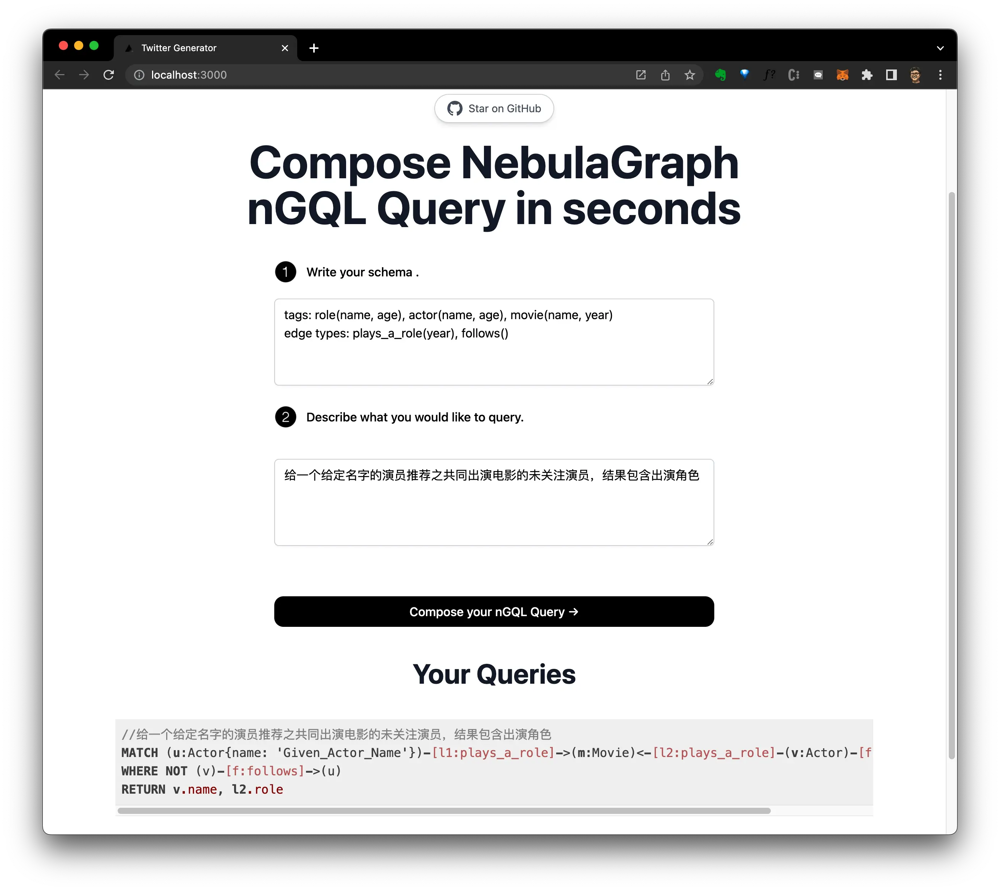

# [nGQL-GPT](https://ngql-gpt.siwei.io/)

This project help compose NebulaGraph Query for you using AI.

[](https://ngql-gpt.siwei.io)

https://user-images.githubusercontent.com/1651790/218627408-995b81e1-9b01-423c-ba90-849faaad6f5d.mp4

## How it works

This project uses the [OpenAI GPT-3 API](https://openai.com/api/) (specifically, text-davinci-003) and [Vercel Edge functions](https://vercel.com/features/edge-functions) with streaming. It constructs a prompt based on the form and user input, sends it to the GPT-3 API via a Vercel Edge function, then streams the response back to the application.

Video and blog post coming soon on how to build apps with OpenAI and Vercel Edge functions!

## Running Locally

After cloning the repo, go to [OpenAI](https://beta.openai.com/account/api-keys) to make an account and put your API key in a file called `.env`.

Then, run the application in the command line and it will be available at `http://localhost:3000`.

```bash
npm run dev
```

## One-Click Deploy

Deploy the example using [Vercel](https://vercel.com?utm_source=github&utm_medium=readme&utm_campaign=vercel-examples):

[](https://vercel.com/new/clone?repository-url=https://github.com/wey-gu/NebulaGraph-GPT&env=OPENAI_API_KEY&project-name=NebulaGraph-GPT&repo-name=NebulaGraph-GPT)
